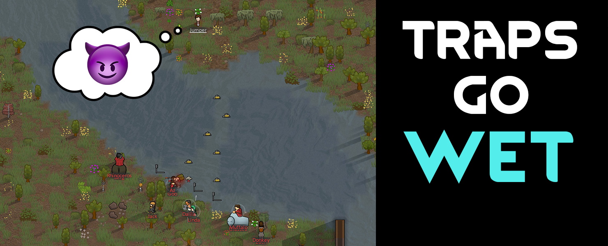

# [JPT] Traps Go Wet
Build traps on water without bridges in RimWorld. 

[**>>> DOWNLOAD IT HERE <<<**](https://github.com/jptrrs/TrapsGoWet/releases/latest)

_Raiders aren't afraid to dip their toes, so why should you have to build a bridge to hold your traps? Just sink them to the bottom!_

This will enable you to build traps on any terrain, including water. Anything with "trap" in its name will be affected, including traps from other mods.

**Bonus:** If you're using one of these fences mod, fences made out of wood or metal will get the same treatment! This should provide you with a complete solution for defenses on water. (I've excluded stone fences from this because I think it still makes sense for flooded terrain to not be able to support them.)
<ul>
<li><a href="https://steamcommunity.com/sharedfiles/filedetails/?id=1803445973">Vanilla Fences</a> & <a href="https://steamcommunity.com/sharedfiles/filedetails/?id=1870822299">Vanilla Fences (Fence Tab)</a></li>
<li><a href="https://steamcommunity.com/sharedfiles/filedetails/?id=2050680665">Architect Expanded - Fences</a>
</li>
</ul>

##

